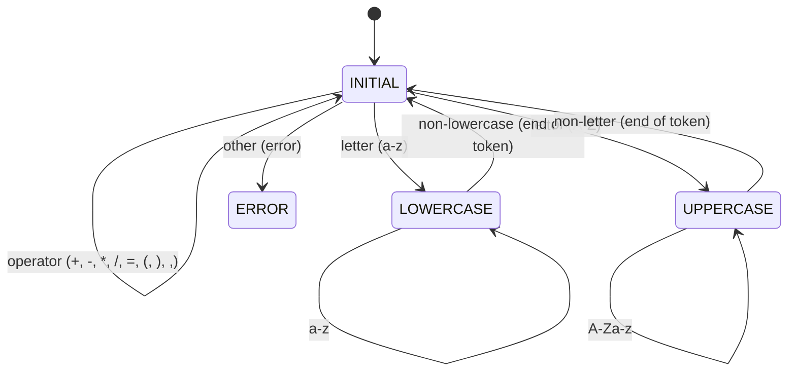

# Tokenizer

```mermaid
stateDiagram-v2
    [*] --> INITIAL
%% Transitions from INITIAL state
    INITIAL --> INITIAL: space, tab, newline
    INITIAL --> INITIAL: operator (+, -, *, /, =, (, ), ,)
    INITIAL --> LOWERCASE: letter (a-z)
    INITIAL --> UPPERCASE: letter (A-Z)
    INITIAL --> ERROR: other (error)
%% Transitions from LOWERCASE (building an identifier)
    LOWERCASE --> LOWERCASE: a-z
    LOWERCASE --> INITIAL: non-lowercase (end of token)
%% Transitions from UPPERCASE (building a reserved word or NUMBER)
    UPPERCASE --> UPPERCASE: A-Za-z
    UPPERCASE --> INITIAL: non-letter (end of token)
```