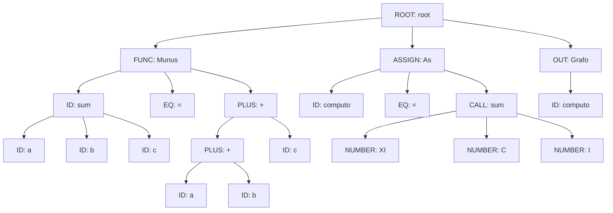

```mermaid

graph TD
    ROOT["ROOT: root"]
%% Level 1 children
    FUNC["FUNC: Munus"]
    ASSIGN["ASSIGN: As"]
    OUT["OUT: Grafo"]
    ROOT --> FUNC
    ROOT --> ASSIGN
    ROOT --> OUT
%% FUNC branch
    FUNC_ID["ID: sum"]
    FUNC_EQ["EQ: ="]
    FUNC_PLUS["PLUS: +"]
    FUNC --> FUNC_ID
    FUNC --> FUNC_EQ
    FUNC --> FUNC_PLUS
%% Children of FUNC_ID (sum)
    ID_A["ID: a"]
    ID_B["ID: b"]
    ID_C["ID: c"]
    FUNC_ID --> ID_A
    FUNC_ID --> ID_B
    FUNC_ID --> ID_C
%% PLUS branch under FUNC
    FUNC_PLUS_PLUS["PLUS: +"]
    FUNC_PLUS_C["ID: c"]
    FUNC_PLUS --> FUNC_PLUS_PLUS
    FUNC_PLUS --> FUNC_PLUS_C
%% Children of nested PLUS
    PLUS_A["ID: a"]
    PLUS_B["ID: b"]
    FUNC_PLUS_PLUS --> PLUS_A
    FUNC_PLUS_PLUS --> PLUS_B
%% ASSIGN branch
    ASSIGN_ID["ID: computo"]
    ASSIGN_EQ["EQ: ="]
    ASSIGN_CALL["CALL: sum"]
    ASSIGN --> ASSIGN_ID
    ASSIGN --> ASSIGN_EQ
    ASSIGN --> ASSIGN_CALL
%% Children of CALL under ASSIGN
    NUMBER_XI["NUMBER: XI"]
    NUMBER_C["NUMBER: C"]
    NUMBER_I["NUMBER: I"]
    ASSIGN_CALL --> NUMBER_XI
    ASSIGN_CALL --> NUMBER_C
    ASSIGN_CALL --> NUMBER_I
%% OUT branch
    OUT_ID["ID: computo"]
    OUT --> OUT_ID

```